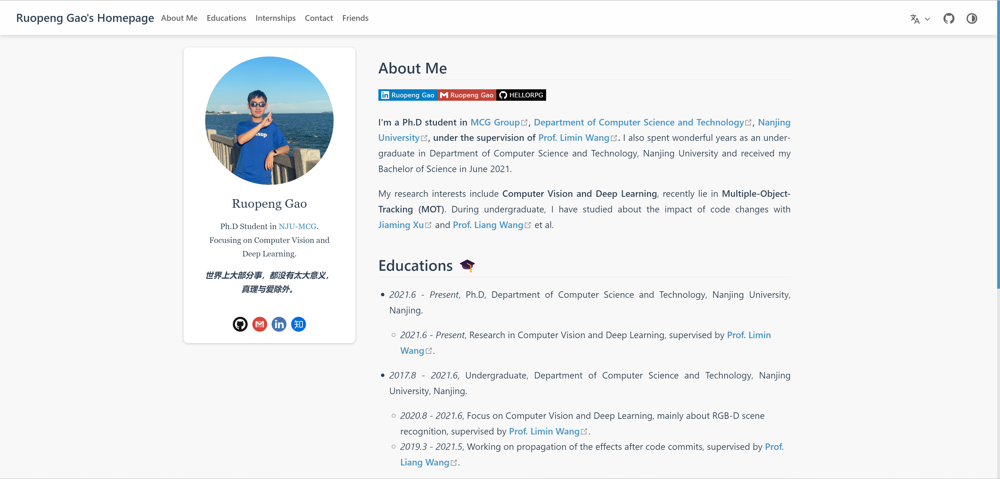
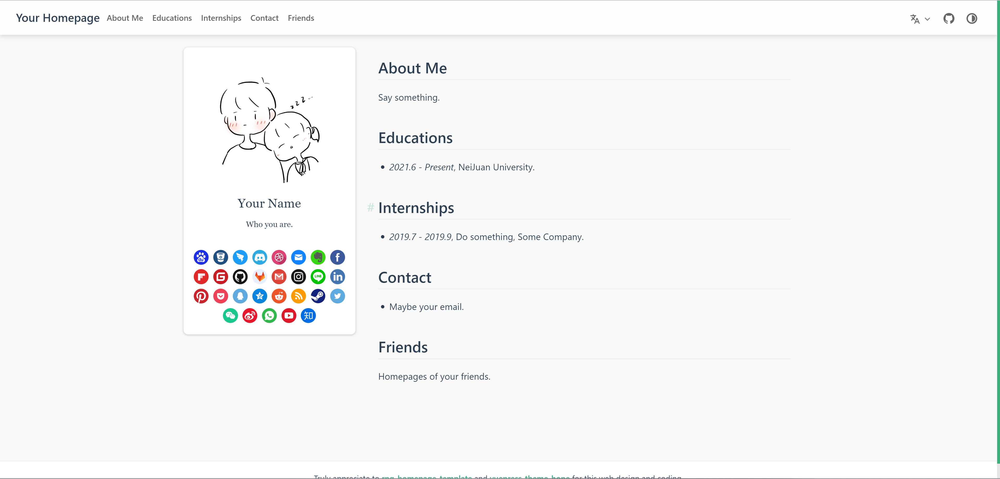

# README
```wiki
@author HELLORPG
@date 2022.8.25
```

[](https://ruopenggao.com)


基于 [vuepress-theme-hope](https://vuepress-theme-hope.github.io/v2/)，修改部分样式和组件，设计实现了个人主页 [Ruopeng Gao's Homepage](https://ruopenggao.com) 的模板。




## 写在前面 :tada:

本人的前端能力可以说是非常差，所以如果代码中有什么问题或者糟糕的写法，欢迎提出。

另外，如果你使用了本仓库的模板，没有其他特殊的原因的话，希望能够在主页中显式提到 [本仓库](https://github.com/HELLORPG/rpg-homepage-template) 和 [vuepress-theme-hope](https://vuepress-theme-hope.github.io/v2/) 主题所做出的贡献。在初始代码生成的 demo 中，页脚部分注明了如上所提到的致谢内容。


## 目录

- [配置环境](#配置环境)
- [相关指令](#相关指令)
- [构建你的主页](#构建你的主页)
- [部署在服务器](#部署在服务器)
- [部署在GitHub](#部署在-GitHub)


## 配置环境

作者使用的配置环境如下：
- MacOS
  - node.js: v18.4.0
  - npm: v8.13.1

- Windows
  - node.js: v16.15.1
  - npm: v8.12.2

使用如下指令即可配置环境：
```shell
npm install
```


## 相关指令

如果你需要在开发环境测试网页，可以使用如下指令：

```shell
npm run docs:dev
```

如果需要打包成为一个部署所需的网站整体，可以运行`build.sh`脚本：

```shell
sh build.sh
```

网站的所有文件会在`docs/.vuepress/dist/`下输出。


## 构建你的主页

本仓库的代码在正确运行之后，可以生成一个样例网站如下所示：



你可以很容易的在这个网站的代码中增加属于你自己的描述，从而快速构建一个属于你的个人主页。对于修改的方式，有两种方法：

### 暴力搜索修改法

这也是我最推荐的方式，如果你不知道需要修改哪里才能够完整的展示你个人的信息，你可以直接选择在文件中搜索你想要修改的部分的文字，并且做出修改（或者仿照其进行增加）即可，而不需要理解他们背后的运作机理。

推荐这种方法的原因主要有两个：

1. 我个人的前端技术非常有限，并且也没有太多的时间写一份文档来详细说明每一个需要修改的部分，能力与时间都非常受限。
2. **这种方法真的足够快。**

### 认真求学修改法

个人主页模板是基于 [vuepress-theme-hope](https://vuepress-theme-hope.github.io/v2/) 搭建的，并且对框架做出了一些修改。因此，**如果想要更好地修改网站并且做出自己的设计，强烈建议参考 [vuepress-theme-hope](https://vuepress-theme-hope.github.io/v2/) 的文档，几乎你的每一个问题都可以得到解答，本仓库并没有对原本的主题做结构上的大修改。**

实际上，如果你觉得仓库中给出的设计和你的想法大相径庭，还是非常建议直接在 vuepress-theme-hope 的主题上进行修改，可塑性会更高。


## 部署在服务器
本人部署在服务器采用的是 Nginx 框架，其他部署方式并未尝试。

### 安装 Nginx
```shell
sudo apt install nginx
```

### 添加网站配置
Nginx 的配置文件位于目录 `/etc/nginx/` 下，可以在 `/etc/nginx/conf.d/` 文件夹中新建对于网站的配置文件 `web-name.conf`。
```text
# /etc/nginx/conf.d/web-name.conf
server {
  server_name hostname1 hostname2;
  root web-dir;
  index index.html;
}
```
修改保存之后，使用如下指令重启服务：
```shell
sudo nginx -s reload
```
参考链接：
- [https://segmentfault.com/a/1190000010487262](https://segmentfault.com/a/1190000010487262)
- [https://blog.csdn.net/qq_38431321/article/details/123018259](https://blog.csdn.net/qq_38431321/article/details/123018259)
- [https://blog.csdn.net/hbysj/article/details/80833810](https://blog.csdn.net/hbysj/article/details/80833810)

### 认证 SSL
可以在所租用云服务器的面板内进行 SSL 的免费认证。
认证之后选择 nginx 格式进行下载，将其中的 `.key` 和 `.pem` 文件上传到服务器。

之后在服务器中 Nginx 配置文件中增加如下的内容：
```text
server {
        listen       443        ssl;
        ssl_certificate         [.pem file path];
        ssl_certificate_key     [.key file path];
        ssl_session_timeout 	5m;
        ssl_protocols TLSv1 TLSv1.1 TLSv1.2;
        ssl_ciphers AESGCM:ALL:!DH:!EXPORT:!RC4:+HIGH:!MEDIUM:!LOW:!aNULL:!eNULL;
        ssl_prefer_server_ciphers on;
}
```
接着重启服务即可通过 `https://` 访问。

为了将所有 http 的访问都重定向到 https 下，可以新建一个配置文件如下：
```text
server {
    listen			80;
    server_name		hostname1 hostname2;
    return 			301	https://$server_name$request_uri;
}
```
重启服务即可。

参考链接：
- [https://segmentfault.com/a/1190000022673232](https://segmentfault.com/a/1190000022673232)


## 部署在 GitHub

vuepress-theme-hope 提供了非常简单的部署到 GitHub 的方法，具体部署方法可以参考其文档中 [部署项目](https://vuepress-theme-hope.github.io/v2/zh/cookbook/tutorial/deploy.html) 一章。

值得注意的是，本仓库在使用 vuepress-theme-hope 建立之初，并没有创建 GitHub 工作流，因此需要根据教程进行创建；又或是可以选择 [直接创建 vuepress-theme-hope 的运行环境](https://vuepress-theme-hope.github.io/v2/zh/cookbook/tutorial/env.html)，在创建过程中选择创建 GitHub 工作流，并且将本仓库中的文件替换到创建好的运行环境中即可。
